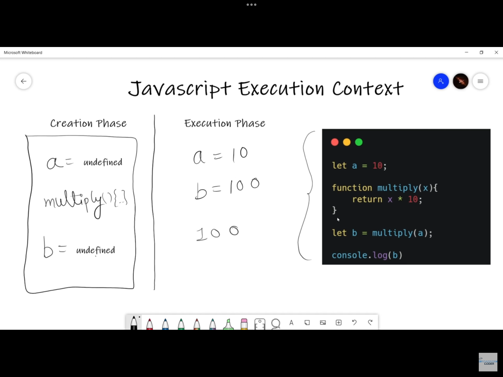

# Notes

### Scope : 
    Scope is a certain region of a program, where a defined variable exists and can be recogised but beyond that it cannot be recognised.

### Types of Scope :
    1) Global Scope
    2) Block Scope
    3) Functional Scope 

### NOTE : 
    `var` has a Functional Scope.
    `let` and `const` are Block Scoped.

### Variable Shadowing :
    In JavaScript, variable shadowing occurs when a variable with the same name as a variable in a higher scope is declared in a lower scope.

    It's a common practice but can lead to confusion if not used carefully because the inner variable will "shadow" the outer variable.

### Example : 
```javascript
function test1(){
    let a = "Hello";

    if (true) {
        let a = "Hii";
        console.log(a)
    }

    console.log(a);    
}
```
In above example, let `a` inside the `if` block shadows the outer let `a`, and they are two separate variables despite having the same name.

### Illegal Shadowing:
    This occurs when trying to shadow a variable using var within the same scope where that variable is already defined using let or const.

### Example : 
```javascript
 function test2(){
        var a = "Hello";
        let b = "Bye";

    if (true) {
        let a = "Hii"; // Legal Shadowing
        var b = "Goodbye"; // Illegal Shadowing
        console.log(a);
        console.log(b);
    }
}
```
In the above example, var b = "Goodbye"; is illegal shadowing because, we can shadow `var`variable by using `let`, but cannot shadow `let` variable by using `var` variable.

### Declaration of `var`, `let` and `const`:

```javascript
var a;
var a;
// This will not give any error, we can re-declare it as many times as we want.

let b;
let b;
// This will throw an error called "Identifier `a` has already been declared".

const c;
const c;
// This will throw an error called "Missing initializer in const declaration".
```
To conclude with above example, `let` and `const` cannot be Re-declared in the same scope, while `var` can be Re-declared in the same scope.

### Declaration without initialization :

```javascript
var a;
// Can be declared without initialization(without giving value)

let b;
// Can be declared without initialization(without giving value)

const c;
// This will throw an error called "Missing initializer in const declaration".
```
To conclude with above example, `let` and `var` can be declared without initialization, while `const` cannot be declared without initialization .

### Re-Initialization : 

```javascript
var a = 5;
a = 6;
// This will not give any error.

let b = 5
b = 6;
// This will also not give any error.

const c = 5;
c = 6;
// This will throw an error called "Assignment to constant variable".
```
To conclude with above example, `let` and `var` can be updated, while `const` cannot be updated.

## JavaScript Execution Context : 


### Hoisting : 
    In JavaScript, hoisting is a behavior where variable and function declarations are moved to the top of their containing scope during the compilation phase.

    However, only the declarations are hoisted, not the initializations or assignments.

```javascript
console.log(c); // => Execution phase
var c = 10; // => Creation phase

// How Javascript visualize the above code
var d;
console.log("D : ",d);
d = 25;
```
In the above example, `console.log(c)`; will result in `undefined` because the variable `c` is hoisted to the top but not initialized until later in the code var `c = 10;`.

```javascript
console.log(c);
let c = 10;
// This will throw an error named "Cannot access 'c' before initialization".
```
`let` helps to overcome the limitations of the `var`.     `let` variables are also hoisted, but in `Temporal deadzone`.

### Temporal Dead Zone (TDZ):
    TDZ is a specific behavior related to variables declared using let and const. It refers to the period between the start of the block scope and the actual declaration of the variable.

    During the TDZ, accessing the variable will result in a ReferenceError(Refer the last example).

```javascript
// Question 1 : 
function abc(){
    console.log(a);

    var a = 10;
}

abc() // undefined
```

```javascript
// Question 2 : 
function abc(){
    console.log(a,b,c)

    const c = 30;
    let b = 20;
    var a = 10;
}
```
In the above example,loging `a` will return `undefined`, but trying to log `b`, and `c` before their respective declarations will result in ReferenceError because they are in the TDZ until they are declared.
