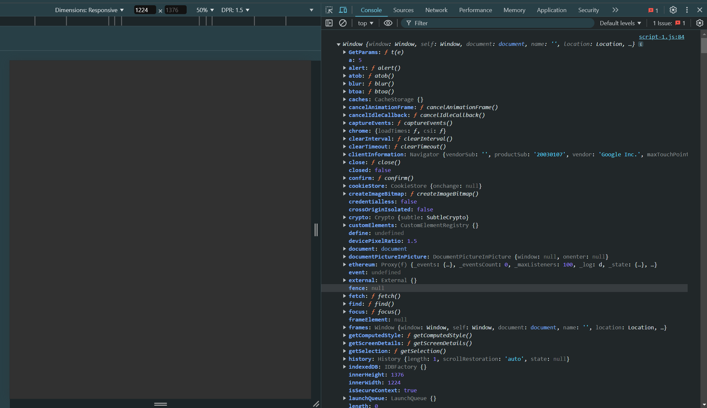

# 'this' keyword :

    - The "this" keyword refers to the context where a piece of code, such as a function's body, is supposed to run.

    - Most typically, it is used in object methods, where this refers to the object that the method is attached to, thus allowing the same method to be reused on different objects.

```javascript
this.a = 5;
console.log(this.a);

Output : 5
```
```javascript
console.log(this);
// Alone, this refers to the global object.
```
Output : 


### 'this' keyword's behaviour inside a normal function : 
```javascript
// Normal function
this.a = 5
function getParams(){
    console.log(this.a);
}
getParams();

Output : 5
// In a function, this refers to the global object.
```

### 'this' keyword's behaviour inside an Arrow function :
```javascript
// Arrow function
this.a = 5
const getParams = () => {
    console.log(this.a);
}
getParams();

Output : 5
// In a function, in strict mode, this is undefined.
```

### 'this' keyword's behaviour inside a normal function which is inside an object :
```javascript
let user = {
    name:"Amith",
    age:23,
    getDetails(){
        console.log(this.name);
    }
}
user.getDetails();

Output : Amith
// In an object method, this refers to the object.
```
```javascript
let user = {
    name:"Amith",
    age:23,
    childObj: {
        newName:"Rao",
        getDetails(){
            console.log(this.newName ," and ", this.name);
        }
    }
}

user.childObj.getDetails();

Output : Rao  and  undefined
```
NOTE : Normal function will only point to the immediate parent.

### 'this' keyword's behaviour inside an Arrow function which is inside an object :
```javascript
let user = {
    name:"Vikrant",
    age:25,
    getDetails:() => {
        console.log(this.name); // Prints nothing
    }
}

user.getDetails();

// Here, "this" is pointing to the "window object" because the value of "this" keyword in arrow function comes from it's parent function
```

```javascript
let user = {
    name: "Arjun",
    age:23,
    getDetails(){
        const nestedArrow = () => console.log(this.name);
        nestedArrow();
    }
}

user.getDetails();
```

### 'this' keyword's behaviour inside a class or a constructor : 
```javascript
class userClass {
    constructor(n){
        this.name = n;
    }

    getDetails(){
        console.log(this.name);
    }
}

const newObj = new userClass("Amith");
newObj.getDetails();

// 'this' keyword insode the "getDetails" function is poitning to all the variables in the constuctor.
```

# Most Asked Interview Questions on "this" Keyword :

### Question 1 : What is the Output?
```javascript
const user = {
    firstName: 'Amith!!!',
    getName() {
      const firstName = 'Rao';
      return this.firstName;
    }
};

console.log(user.getName());
```

### Question 2 : What is the result of accessing its `ref` ? Why ?
```javascript
// Version 1 : 
function makeUser() {
    return {
        name: "John",
        ref: this,
    };
}
  
let user = makeUser();
  
console.log(user.ref);
console.log(user.ref.name); // Undefined

// Output : window object on browser and global object on node environment
```

```javascript
// Version 2 : 
function makeUser() {
    return {
        name: "John",
        ref(){
            return this;
        }
    };
}
  
let user = makeUser();
  
console.log(user.ref());
console.log(user.ref().name); // Jhon

// Output : Logs the returned object
```

### Question 3 : What logs to console the following code snippet ?
```javascript
const user = {
    name: 'Piyush Agarwal!',
    logMessage() {
      console.log(this.name); 
    },
};
setTimeout(user.logMessage, 1000);

// Loggs nothing, because setTimeout is expecting a callback and not an object method.
```
Solution : 
```javascript
const user = {
    name: 'Piyush Agarwal!',
    logMessage() {
      console.log(this.name); 
    }
};

setTimeout(function() {
    user.logMessage();
}, 1000);

// Output : Piyush Agarwal!
```

### Question 4 : What is the Output ?
```javascript
const userD = {
    name: 'Piyush',
    greet() {
      return `Hello, ${this.name}!`;
    },
    farewell: () => {
      return `Goodbye, ${this.name}!`;
    }
};

console.log(userD.greet());
console.log(userD.farewell())

// Output : 
// Hello, Piyush!
// Goodbye, undefined!
```

### Question 5 : Create an object calculator ?
```javascript
const calculator = {
    read() {
        this.a =  +prompt("a = ");
        this.b =  +prompt("b = ");
    },

    sum(){
        return this.a + this.b;
    },

    mul(){
        return this.a * this.b;
    }
}

calculator.read();
console.log(calculator.mul());
console.log(calculator.sum());
```

### Question 6 : Create an object calculator ?
```javascript
var length = 4;

function callback(){
    console.log(this.length);
}

const user = {
    length: 5,
    method(fn){
        fn();
    },
};

user.method(callback); // 4
```

```javascript
var length = 4;

function callback(){
    console.log(this.length);
}

const user = {
    length: 5,
    method(){ // arguments = [callback, 2, 3]
        arguments[0]();
    },
};

user.method(callback, 3, 4); // 3

// Array itself is an Object, when a callback is called, it targets it's parent object i.e [callback, 2, 3]

// [callback, 2, 3].length = 3
```

### Question 7 : Implement calc
```javascript
const calc = {
    total : 0,
    sum(a){
        this.total += a;
        return this;
    },
    mul(b){
        this.total *= b;
        return this;
    },
    sub(c){
        this.total -= c;
        return this;
    }
}

const result = calc.sum(50).sub(30).mul(5);
console.log(result.total);
```